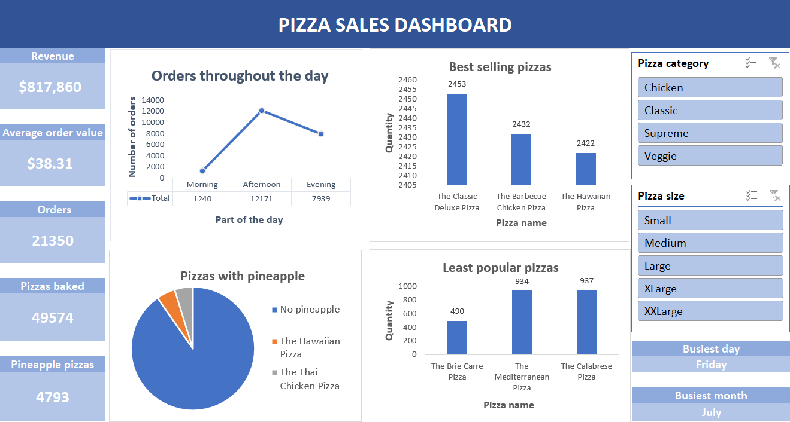

# Excel_Analysis_project

<h1 align="center">Pizza Restaurant Sales Analysis (Excel)</h1>

 

<h2 align="center">Project overview</h2>

- The Dataset contains Pizza restaurant information from 2015 and it was found in Kaggle
- Excel was used for this project
- The Dataset contains 48.621 records
- The Dataset was checked for missing values and duplicates
- The project contains some simple formulas, pivot tables, visualizations  and a dashboard 

 

<h2 align="center">Objectives</h2>

The primary goal was to provide some insights, to the pizza restaurant manangers, in order to improve the restaurant's operations.

Some questions that were asked:
- What days and times do we tend to be busiest?
- How many pizzas are we making during peak periods?
- What are our best and worst-selling pizzas?
- What's our average order value?
- How well are we utilizing our seating capacity? (we have 15 tables and 60 seats)
- Do people like pineapple on pizzas?
- What is the ditribution of pizza sizes and pizza categories?
_ what's the most and least profitable pizzas?
- Which indredients do we use the most?

 

<h2 align="center">Visualizations</h2>

 

 

 

 

<h2 align="center">Conclusions</h2>

 

- The busiest part of the day is during the Afternoon (12171 pizzas baked during the afrernoons)
- The busiest day od the month is Friday (8242 pizzas baked in Fridays)
- The busiest month of the year is July (4392 pizzas baked in July)
- Best selling pizza is the Classic Deluxe pizza
- Worst selling pizza is the Brie Carre pizza
- Average order value: $38.31 (Revenue/Orders)
- The restaurant is utilizing its seating capacity pretty well,considering that at the busiest time of the year, there were enough seats left, for the customers.
- Most pizza orders doean not contain pineapple however there are 810 orders containing only pizzas with pineapple and nothing else.It is safe to say that pineapple pizzas have some fans but in general people does not prefer them.
- Most profitable pizza is the Thai chicken pizza (which is a pineapple pizza)
- Least profitable pizza is the Brie Carre pizza
- Most popular pizza size is Large
- Most popular pizza category is Classic
- Most used ingredients are Garlics, followed by Tomatoes and Red Onions
